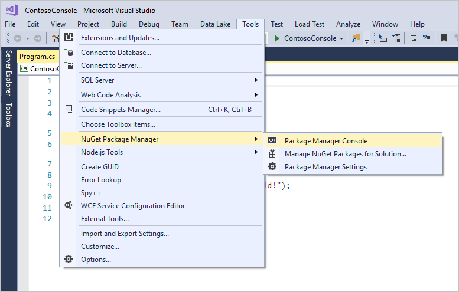

# Azure .NET API Reference

Use the Azure libraries for .NET to manage, integrate, and consume Azure services in your .NET applications.

| &nbsp; | &nbsp; | &nbsp; |
|--------|--------|--------|
| [Active Directory](/dotnet/api/overview/azure/activedirectory) | [App Service](/dotnet/api/overview/azure/appservice) | Automation |
| Backup | Batch | Billing |
| CDN | [Cosmos DB](/dotnet-test-service-pages/cosmosdb) | Data Factories |
| Data Lake Analytics | Data Lake Store | Devices |
| DNS | Event Hub | HD Insights |
| Insights | IoT | Key Vault |
| Media Services | [MySQL](/dotnet/api/overview/azure/mysql) | Network |
| Notification Hubs | [PostgreSQL](/dotnet/api/overview/azure/postgresql) | Power BI |
| Recovery Services | Redis Cache | Relay |
| Resources | Search | Service Bus |
| Service Fabric | [SQL](/dotnet-test-service-pages/sql) | [Storage](/dotnet-test-service-pages/storage) |
| Stream Analytics | Traffic Manager | [Virtual Machines](/dotnet/api/overview/azure/virtualmachines) |
| &nbsp; | &nbsp; | &nbsp; |

## Installation

### Visual Studio

If you're using Visual Studio, use the **NuGet Package Manager Console** to import the package into your project.

1. With your Visual Studio solution open, launch the console by clicking **Tools**, followed by **NuGet Packager Manager**, and then click **Package Manager Console**.  

    

2. In the console window, use the **Install-Package** cmdlet to download and install the NuGet package.  For example, to include the latest version of the fluent [Microsoft Azure Management Client Library](http://www.nuget.org/packages/Microsoft.Azure.Management.Fluent) for .NET:

    ```powershell
    Install-Package Microsoft.Azure.Management.Fluent
    ``` 
    To use a specific version, include the version number like this:

    ```powershell
    Install-Package Microsoft.Azure.Management.Fluent -Version 1.0.0
    ``` 

### Command line

If you're using .NET Core with Visual Studio Code (or any other editor), use the `dotnet add package` command.  The following will include the latest version of the fluent [Microsoft Azure Management Client Library](http://www.nuget.org/packages/Microsoft.Azure.Management.Fluent) for .NET:

```bash
dotnet add package Microsoft.Azure.Management.Fluent
```
To use a specific version, include the version number like this:

```bash
dotnet add package Microsoft.Azure.Management.Fluent -v 1.0.0
```