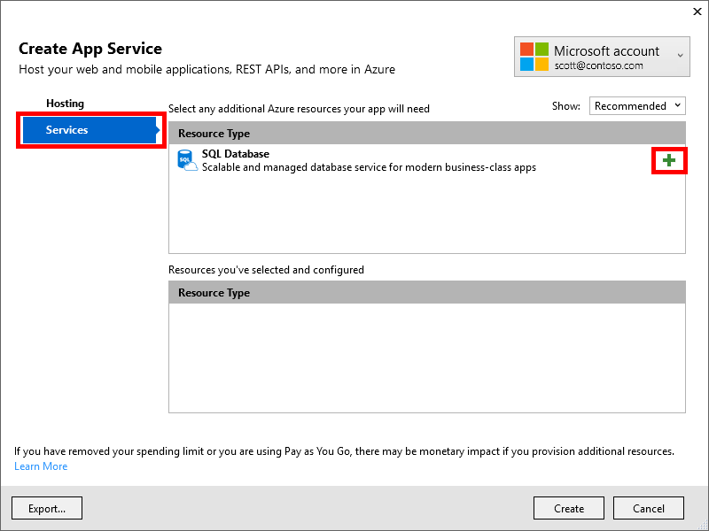

# Get started with .NET for Azure developers

This tutorial will walk you through building and deploying an ASP.NET application to Microsoft Azure using Visual Studio.  When finished, you'll have deployed the application to Azure Web Apps with an Azure SQL Database back end.

## Prerequisites

* [Visual Studio 2017](https://www.visualstudio.com/downloads/) with the following [workloads](/visualstudio/install/modify-visual-studio):
    * ASP.NET and web development
    * Azure development
* [SQL Server 2016 Express LocalDB](https://msdn.microsoft.com/en-us/library/hh510202.aspx)

    >[!TIP]
    >This can be installed with **Visual Studio 2017** as part of the **.NET desktop development** workload. 
* A [Microsoft Azure subscription](https://azure.microsoft.com/free/)


## Downloading and running the application

First, get the sample code for this walkthrough and run it locally.

1. Download the sample code from GitHub.
    
    [Sample - Contoso University](https://github.com/CamSoper/contoso-university)
    
    Alternatively, clone it to your local machine with the following [git command-line client](https://git-scm.com/) command:

    ```cmd
    git clone https://github.com/CamSoper/contoso-university
    ```

2. Open **ContosoUniversity.sln** in Visual Studio.

3. Press **CTRL+F5** to restore the project's NuGet packages, build the project, and run it locally.

## Deploying the application to Azure

You've successfully built the application and you've run it locally using IISExpress as its web server and SQL Server Express LocalDB as its database.  Next, you'll deploy your web application to the cloud.

> [!IMPORTANT]
> If this is the first time you've used the Azure tools in Visual Studio, you may be prompted to log in.  Be sure you're signed into Visual Studio with the same account your Azure subscription is associated with.

1. In **Visual Studio Solution Explorer**, right-click on the project name and select **Publish...**

2. Using the **Publish** dialog, select **Microsoft Azure App Service**, select **Create New**, and then click **Publish**

3. Complete the **Create App Service** dialog as follows:

    * Enter a unique **Web App Name**.  This will be part of the URL for your app.
    * Select the Azure **Subscription** you're deploying to.
    * Select or create a **Resource Group** for your web application.
    * Select or create an **App Service Plan** to determine the pricing used for your application.  Here's [more information about App Service Plans](/azure/app-service/azure-web-sites-web-hosting-plans-in-depth-overview).

4. Click the **Services** heading on the left side of the dialog.  Click the plus sign next to **SQL Database**

    

5. In the **Configure SQL Database** dialog, next to **SQL Server**, click **New...**.

6. Complete the **Configure SQL Server** dialog as follows:

    * Enter a unique **Server Name**.  This will be part of the address for your Azure SQL Database service.
    * Enter an **Administrator Username**.  Common names like *admin*, *sa*, *root*, etc., are not allowed.
    * Enter an **Administrator Password**.
    * Confirm the **Administrator Password**.
    * Click **OK** to return to the **Configure SQL Database** dialog.

7. Complete the **Configure SQL Database** dialog as follows:

    * **SQL Server**, **Administrator Username**, and **Administrator Password** should already be populated with the information you entered in the previous step.
    * Enter a **Database Name** for your deployed database.  The default is acceptable.
    * In **Connection String Name**, enter *SchoolContext*.

        > [!IMPORTANT]
        > *SchoolContext* should match the name of the connection string in the *web.config* file. Be sure you enter it exactly as written.
    * Click **OK** to return to the **Create App Service** dialog.    

4. Click **Create** to deploy the application.  When deployment is complete, a browser will open with your deployed application.

## Next steps

* [Get started with a sample application using Azure DocumentDB](get-started-docdb.md)
* [Use Azure Active Directory for authentication in an ASP.NET web application](/azure/active-directory/develop/active-directory-devquickstarts-webapp-dotnet)
* [Build an Azure Web App using Azure SQL Database](/azure/app-service-web/web-sites-dotnet-get-started)
* [Try a .NET sample application with Azure Storage](/azure/storage/storage-samples-dotnet)


