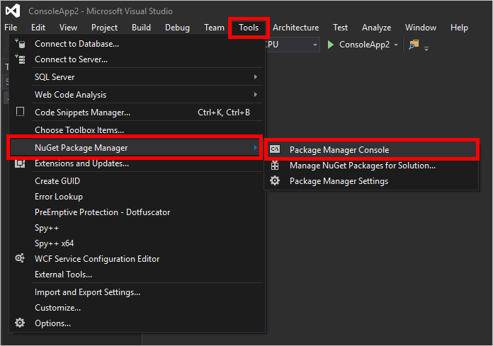

## Installation

### Visual Studio

If you're using Visual Studio, use the **NuGet Package Manager Console** to import the package into your project.

1. With your Visual Studio solution open, launch the console by clicking **Tools**, followed by **NuGet Packager Manager**, and then click **Package Manager Console**.  

    

2. In the console window, use the **Install-Package** cmdlet to download and install the NuGet package.  For example, to include the latest version of the [Azure Resource Management Library](http://www.nuget.org/packages/Microsoft.Azure.Management.ResourceManager) for .NET:

    ```powershell
    Install-Package Microsoft.Azure.Management.ResourceManager -Pre 
    ``` 
    To use a specific version, include the version number like this:

    ```powershell
    Install-Package Microsoft.Azure.Management.ResourceMananger -Version 1.4.0-preview
    ``` 

### .NET Core

If you're using .NET Core with Visual Studio Code (or any other editor), edit your csproj file to add the package as a **PackageReference** element.  This example uses a specific version of **Microsoft.Azure.Management.ResourceManager**, which is the best practice, but NuGet [floating versions](/nuget/consume-packages/package-references-in-project-files#floating-versions) are also supported.

```xml
<Project Sdk="Microsoft.NET.Sdk">

  <PropertyGroup>
    <OutputType>Exe</OutputType>
    <TargetFramework>netcoreapp1.1</TargetFramework>
  </PropertyGroup>

  <ItemGroup>
    <PackageReference Include="Microsoft.Azure.Management.ResourceManager" Version="1.4.0-preview" />
  </ItemGroup>

</Project>
```

> [!TIP]
> Previous versions of .NET Core used project.json files instead of csproj.  To learn about mapping project.json to csproj, [see this document](/dotnet/articles/core/tools/project-json-to-csproj).
