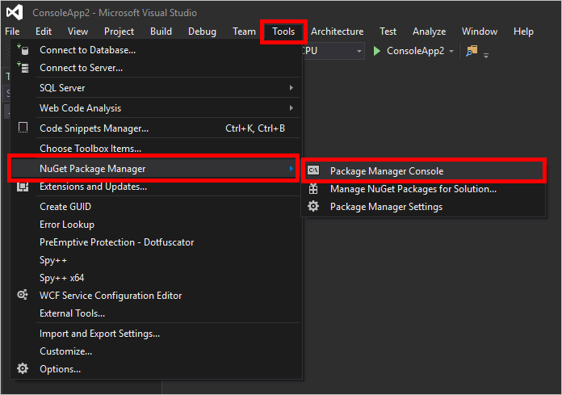

# Azure NuGet Packages

Use the libraries in the .NET SDK for Azure to manage and consume Azure services in your applications.  

## Installation

### Visual Studio

If you're using Visual Studio, use the **NuGet Package Manager Console** to import the package into your project.

1. With your Visual Studio solution open, launch the console by clicking **Tools**, followed by **NuGet Packager Manager**, and then click **Package Manager Console**.  

    

2. In the console window, use the **Install-Package** cmdlet to download and install the NuGet package.  For example, to include the latest version of the [Azure Resource Management Library](http://www.nuget.org/packages/Microsoft.Azure.Management.Resources) for .NET:

    ```powershell
    Install-Package Microsoft.Azure.Management.Resources -Pre 
    ``` 
    To use a specific version, include the version number like this:

    ```powershell
    Install-Package Microsoft.Azure.Management.Resources -Version 2.20.1-preview
    ``` 

### .NET Core

If you're using .NET Core with Visual Studio Code (or any other editor), edit your project.json file to add the package to the project dependencies.  This example uses a specific version of **Microsoft.Azure.Management.Resources**, but you can use [wildcards and comparison operators](https://docs.microsoft.com/en-us/dotnet/articles/core/tools/project-json#dependencies).

```json
{
  "version": "1.0.0-*",
  "buildOptions": {
    "debugType": "portable",
    "emitEntryPoint": true
  },
    "frameworks": {
        "netcoreapp1.1": {
            "dependencies": {
                "Microsoft.NETCore.App": {
                    "type": "platform",
                    "version": "1.1.0"
                }
            },
            "imports": "dnxcore50"
        }
    },
    "dependencies": {
        "Microsoft.Azure.Management.Resources": "2.20.1-preview"
    }
}
```

[!WARNING] Be sure you're editing the top-level **dependencies** object, and not the framework dependencies.

## Azure services packages

These libraries are used to consume services in Azure.

Service | Package
--------|--------
[Storage](https://docs.microsoft.com/azure/storage/) | [WindowsAzure.Storage](http://www.nuget.org/packages/WindowsAzure.Storage)
[HD Insight](https://docs.microsoft.com/en-us/azure/hdinsight/) | [Microsoft.Azure.Management.HDInsight.Job](http://www.nuget.org/packages/Microsoft.Azure.Management.HDInsight.Job/)